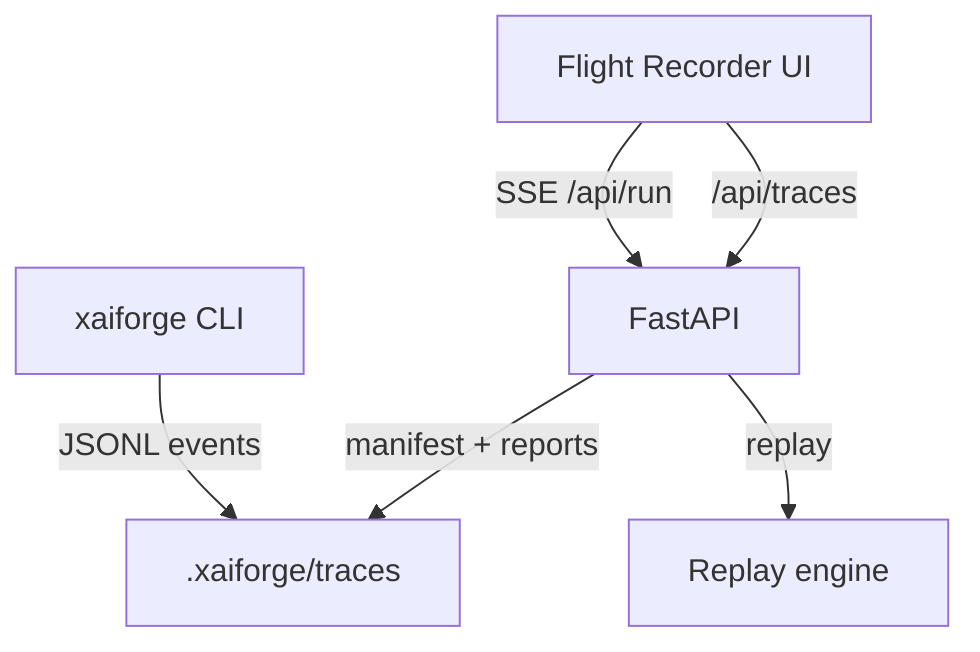

# xAI-Forge


Deterministic agent runtime + Flight Recorder UI with a Grok-coded vibe. Runs locally,
ships with an offline-friendly toolbelt, and keeps everything traceable.

## Why this is sick

- **Flight Recorder UI** with timeline, spans tree, tool table, and metrics.
- **Live run streaming** from the browser (SSE-based, offline-first).
- **Replay + integrity checks** via rolling SHA-256 hashes.
- **Compare view** for side-by-side telemetry diffs.
- **Zero paid services** required by default.
- **Tool registry + schemas** exposed over API for UI introspection.
- **Deterministic traces** stored as JSONL for auditability.
- **Command palette** for power users (`/` to open).

## 1-minute demo

```bash
python -m venv .venv
source .venv/bin/activate
pip install -e .

python -m xaiforge run --task "Solve 23*47 and show your steps"
python -m xaiforge serve
```

```bash
cd web
npm install
npm run dev
```

Open:
- API: http://localhost:8000
- UI: http://localhost:5173

In the UI you can start new runs, replay traces, and compare two traces.


## Architecture



## Design philosophy

- **Determinism**: identical inputs yield identical traces.
- **Verification**: replays recompute hashes for integrity.
- **Offline-first**: tools and providers default to local execution.

## Command Reference

```bash
python -m xaiforge run --task "Search this repo for 'TODO'" --root .
python -m xaiforge serve
python -m xaiforge replay <trace_id>
python -m xaiforge traces
python -m xaiforge doctor
python -m xaiforge bench
python -m xaiforge ui
```

## Documentation

- [Runtime design](docs/DESIGN.md)
- [Event spec](docs/EVENT_SPEC.md)
- [Security model](docs/SECURITY.md)
- [Providers](docs/PROVIDERS.md)
- [Tools](docs/TOOLS.md)
- [Roadmap](docs/ROADMAP.md)

## Troubleshooting

- Ensure Python 3.11+ and Node 18+ are installed.
- `python -m xaiforge doctor` checks basics.
- If ports 8000/5173 are busy, pass `--port` or update Vite config.

## License

Apache-2.0
