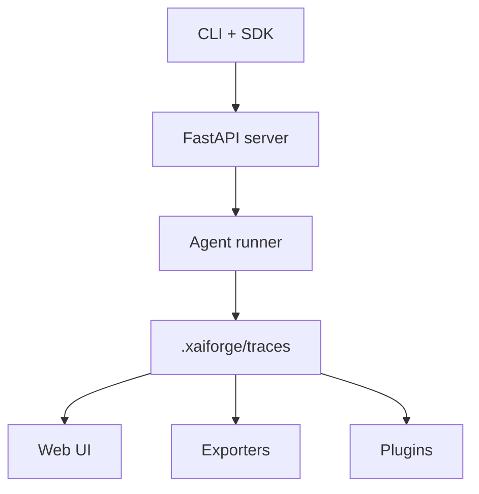

# xAI-Forge


**xAI-Forge** is a deterministic agent runtime, trace store, and UI for building reproducible AI
runs. It ships with a typed Python SDK, plugin hooks, trace exporters, and a local-first workflow
that keeps everything auditable.

> Why xAI-Forge exists: teams need a way to capture, replay, and explain agent behavior without
> relying on paid services. xAI-Forge makes trace integrity a first-class feature.


## Install

### Runtime (CLI + API)

```bash
python -m venv .venv
source .venv/bin/activate
pip install -e .
```

### Python SDK

```bash
pip install -e ".[sdk]"
```

## Quickstarts

### CLI

```bash
python -m xaiforge run --task "Solve 23*47 and show your steps"
python -m xaiforge export latest --format markdown
python -m xaiforge query "type=tool_call AND tool~search"
```

### Python SDK

```python
from xaiforge_sdk import Client

client = Client("http://127.0.0.1:8000")
for event in client.start_run("Summarize the repo"):
    print(event.type, event.ts)
```

### UI

```bash
python -m xaiforge serve
cd web
npm install
npm run dev
```

Open:
- API: http://localhost:8000
- UI: http://localhost:5173

## Architecture



See [ARCHITECTURE.md](ARCHITECTURE.md) for the full data flow.

## Security model

xAI-Forge keeps all traces on disk by default, supports redaction plugins, and is offline-first.
Read more in [docs/SECURITY.md](docs/SECURITY.md).

## Reproducibility

- Deterministic traces are hashed (rolling SHA-256).
- `python -m xaiforge replay <trace_id>` replays and verifies integrity.
- `scripts/gen_sample_traces.py` seeds example traces.
- `web/scripts/capture_screenshots.ts` regenerates UI screenshots using Playwright.

## Documentation

- [Features](docs/FEATURES.md)
- [SDK](docs/SDK.md)
- [Runtime design](docs/DESIGN.md)
- [Event spec](docs/EVENT_SPEC.md)
- [Security model](docs/SECURITY.md)
- [Providers](docs/PROVIDERS.md)
- [Tools](docs/TOOLS.md)
- [Roadmap](docs/ROADMAP.md)

## License

Apache-2.0
